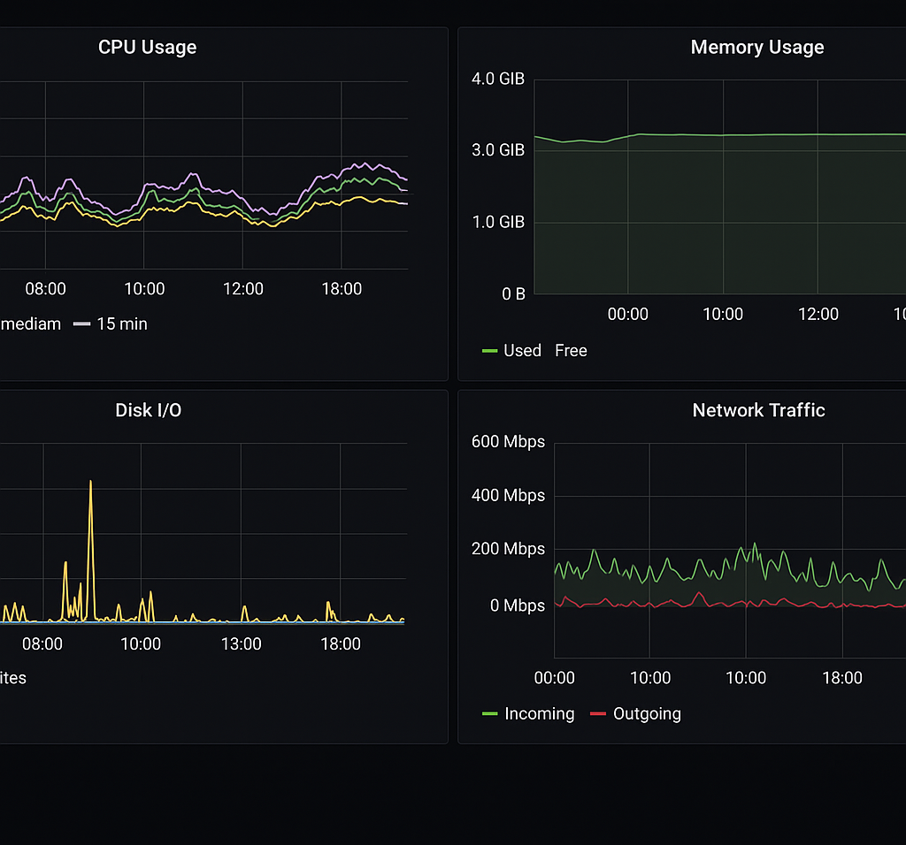

# Infra Monitoring Stack

This stack sets up **AdGuard Home** for DNS filtering, **Prometheus** for metrics collection, **Grafana** for dashboards, and **NGINX + Certbot** for secure public access.

---

## Stack Components

- **AdGuard Home** - Local DNS filtering  
- **Prometheus** - Metrics scraper and storage  
- **Grafana** - Visualization UI for Prometheus metrics  
- **Node Exporter** - Exposes host machine metrics  
- **NGINX + Certbot** - TLS reverse proxy with auto HTTPS  

---

## Usage

### 1. Docker Compose

cd docker  
docker-compose up -d

Access:  
- AdGuard: http://localhost:3000  
- Grafana: https://yourdomain.com (via NGINX + HTTPS)  
- Prometheus: http://localhost:9090

### 2. Ansible Deployment

ansible-playbook ansible/playbook.yml -i ansible/inventory.ini

### 3. Terraform AWS Setup

cd terraform  
terraform init  
terraform apply

### 4. GitHub Actions CI/CD

On push to main, Docker Compose redeploys to the server via SSH automatically.

---

## Default Grafana Login

- User: admin  
- Password: admin  

---

## Monitoring Dashboards

### 1. Docker/Container Stats (via cAdvisor)  
  
Shows container CPU usage, memory consumption, network I/O, and restart counts for your Docker containers.

---

### 2. Network Traffic / DNS Clients  
  
Visualizes DNS queries over time, top DNS clients by query volume, bandwidth usage, and a ranking table of clients.

---

### 3. AdGuard Home Overview  
  
Displays key AdGuard metrics including total DNS queries, blocked queries, percentage blocked, and client usage trends.

---

### 4. Multi-panel Monitoring Overview  
  
A comprehensive overview displaying CPU, memory usage, network stats, and DNS query details for quick system health checks.

---
